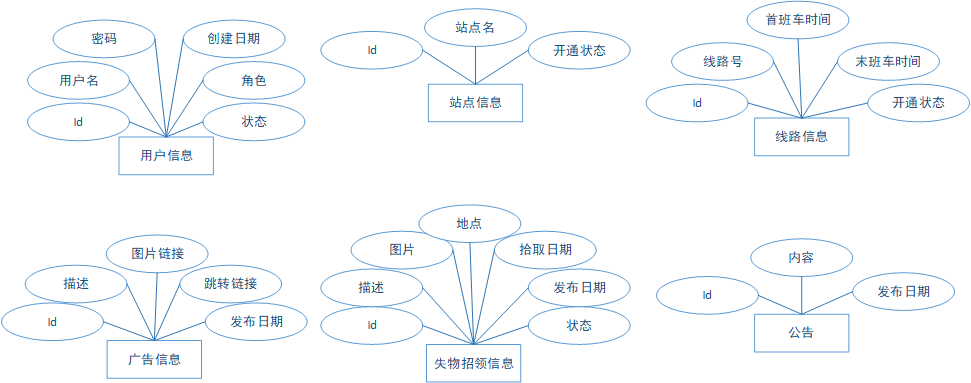

# 基于 SpringBoot 的重庆公交查询系统设计与实现

## 1. 项目概述

### 1.1 引言

### 1.2 实现目标

- 后台管理子系统

  1. 实现管理员登录功能
  2. 实现数据库的备份和恢复功能
  3. 实现添加公交线路站点功能
  4. 实现更改已有公交线路站点功能
  5. 实现广告投放功能
  6. 实现添加失物公告功能
  7. 统计各个线路、站点、时段流量等信息，并在前台实现动态可视化
  8. ……

- 客户端子系统
   1. 实现查询城市公交线路信息功能
   2. 实现查询站点和换乘方案功能
   3. 实现查询未来规划线路功能
   4. 实现查询失物招领信息功能
   5. ……

## 2. 需求分析

### 2.1 需求概述

### 2.2 运行环境

### 2.3 技术栈

## 3. 概要设计

### 3.1 后端设计

#### 3.2 后台管理系统设计

##### 3.1.1

#### 3.3 用户展示系统设计

## 4. 详细设计

### 4.1 后端详细设计

### 1.1.1 后端 API

### 1.1.2 管理员子系统

### 1.1.3 用户子系统

### 1.1 系统详细设计

#### 1.1.1 系统角色

 - 后台管理员

   1. 数据库的备份和恢复
   2. 添加公交线路站点
   3. 更改已有公交线路站点
   4. 广告投放
   5. 失物公告
   6. 统计各个线路、站点、时段流量等信息，并在前台实现动态可视化
   7. ……

 - 普通用户

   1. 查询城市公交线路信息
   2. 查询站点和换乘方案
   3. 查询未来规划线路
   4. 查询失物招领信息
   5. ……

### 1.2 系统 ER 图

### 1.2 数据库设计

1.2.1. 用户表
  + id
  + 用户名
  + 密码
  + 创建日期
  + 角色（用户、管理员）

1.2.2 站点
  + id
  + 站点名
  + 所属线路 id
  + 序号

1.2.3 公交
  + id
  + 代号

1.2.4 线路
  + id
  + 序号

### 3）API 设计

## 二、项目实现

### 1）生成后端代码框架

### 2）初始化前端代码框架
