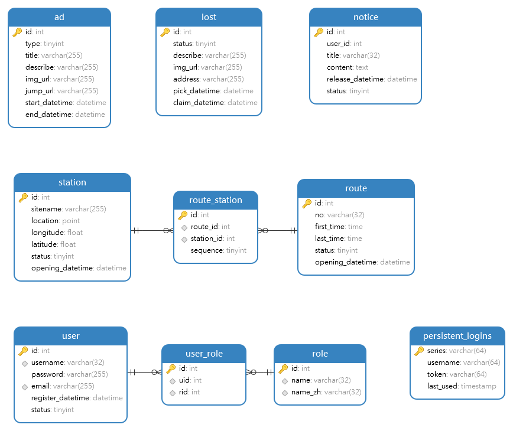

# 基于 SpringBoot 的重庆公交查询系统设计与实现

## 1 绪论

该部分阐述公共交通信息查询系统的研究现状和发展趋势、实现的方法和将要达到的目标。

### 1.1 研究现状和发展趋势

在当今快速发展的城市社会中，人们对出行的便利性需求日益增加。公交系统作为城市交通的重要组成部分，为市民提供了便捷的出行选择。然而，由于城市道路交通的复杂性和公交线路的繁多性，市民在选择公交出行时常常面临各种困扰和挑战。

首先，市民经常不清楚在哪里乘坐公交车。城市的公交站点分布广泛，有时候市民可能不知道离自己最近的公交站点在哪里，或者不确定哪个站点是他们需要乘坐的线路的起点站。

其次，市民可能不知道应该选择哪条公交线路。随着城市的发展，公交线路数量不断增加，线路之间的差异和覆盖范围也日益复杂。市民在选择公交线路时常常面临迷茫，不知道哪条线路是最快捷、最方便的选择，或者哪条线路可以直达目的地。

此外，市民对公交车的到达时间也常常一无所知。在等待公交车的过程中，市民往往不知道具体的到达时间，无法准确估计等待的时间长度，给出行计划带来不确定性。

为了解决这些问题，一个高效、方便、可靠的公共交通信息查询系统应运而生。这个系统可以为市民提供实时、准确的公交线路、站点和到达时间等信息，以满足市民对出行的需求。

通过这个系统，市民可以轻松地查询离自己最近的公交站点，并了解该站点的线路覆盖情况。市民可以输入起点和终点信息，系统将根据实时数据和路线规划算法，给出最佳的乘车方案，包括需要换乘的线路和具体的乘车时间。这样，市民就可以事先规划好自己的出行路线，提前预估出行时间，减少等待和换乘的时间成本。

此外，该系统还可以提供未来规划线路的查询功能。市民可以了解到城市交通规划的最新动态，知道哪些新的线路即将开通，以便在未来的出行中选择更加便利的线路。

除了公交线路和站点的查询，该系统还可以提供失物招领信息的查询功能。市民可以发布和查询失物招领信息，帮助失主找回遗失物品，增加社会资源的利用效率。

综上所述，一个高效、方便、可靠的公共交通信息查询系统对于现代化城市的发展具有重要意义。它可以提升市民的出行体验，减少出行的不确定性，优化交通资源的利用，提高城市交通的效率和便利性。这不仅有助于改善市民的生活质量，也为城市的可持续发展做出了积极的贡献。

### 1.2 研究方法

首先进行相关领域的调研和文献综述，了解当前公共交通信息查询系统的研究现状、发展趋势和存在的问题。通过对已有研究的总结和分析，找出研究的空白点和改进的方向。

然后收集目标城市的公交数据，包括公交线路、站点、地理位置、换乘信息、票价、运营时间等信息。可以通过公交管理部门、数据开放平台或第三方数据提供商获取数据。并对获取的数据进行清洗、整理和预处理，确保数据的准确性和可用性。

基于收集到的数据和研究目标，设计公共交通信息查询系统的数据库结构、系统架构和功能模块。可以采用关系型数据库如MySQL或键值对数据库如Redis进行数据的存储。根据设计的要求，实现系统的原型或者模拟系统，包括前端页面、后端逻辑和数据接口等。

然后再对设计的系统进行评估和性能分析。可以通过用户调查、用户体验测试、模拟实验或者实际测试等方式，评估系统的可用性、准确性和效率。同时，对系统的性能进行分析，包括响应时间、并发处理能力等指标。

最后根据评估和性能分析的结果，对系统的优点、不足和改进方向进行分析。可以比较该系统与其它类似系统的性能和功能，探讨其在提供城市公交信息查询服务方面的优势和局限性。总结研究成果，回顾研究目标和达成程度，并提出未来进一步改进和发展的建议。

### 1.3 实现目标

设计并开发出一个高效、方便、可靠的公共交通信息查询系统，满足市民对公交出行的需求，提供实时、准确的公交线路、站点和到达时间等信息。

## 2. 需求分析

该部分阐述公共交通信息查询系统将要实现的功能、系统运行的环境以及实现该系统需要用到的前端后端技术。

### 2.1 功能需求

#### 2.1.1 后台管理子系统功能需求

1. 实现管理员登录功能
2. 实现数据库的备份和恢复功能
3. 实现添加、删除、修改公交线路功能
4. 实现添加、删除、修改公交站点功能
5. 实现广告投放功能
6. 实现添加失物公告功能
7. 统计各个线路、站点、时段流量等信息，并在前台实现动态可视化
8. ……

#### 2.1.2 客户端子系统功能需求

1. 实现查询城市公交线路信息功能
2. 实现查询站点和换乘方案功能
3. 实现查询未来规划线路功能
4. 实现查询失物招领信息功能
5. ……

### 2.2 运行环境需求

#### 2.2.1 后端

- Windows服务器

或

- Linux服务器

#### 2.2.2 后台管理子系统

- PC端浏览器（Chrome、Edge、FireFox、Safari、360 浏览器、QQ浏览器等）

#### 2.2.3 客户端子系统

- 移动端浏览器（UC、Quark、QQ浏览器等）

## 3 开发工具及技术

### 3.1 后端工具及技术

#### 3.1.1 Java 17.0.2

Java 17在2021年9月14日正式发布，是一个长期支持（LTS，Long-Term-Support）版本，是继Java 8以来最重要的长期支持版本，带来了许多新特性。并且是Spring6.x和SpringBoot3.x的最低支持版本

#### 3.1.2 Spring Boot 3.2.2

Spring Boot是一个基于Spring框架的开发框架，用于快速构建Java应用程序。它提供了自动化配置和约定优于配置的原则，简化了Spring应用程序的开发和部署过程。

#### 3.1.3 Spring Security 3.2.2

Spring Security是一个用于身份验证和授权的安全框架。它提供了一套强大的安全性功能，用于保护应用程序的资源和数据。

#### 3.1.4 SpringDoc 2.3.0

SpringDoc是一个用于生成和展示API文档的开源库。它基于Spring框架和Swagger规范，可以自动生成API文档，并提供可视化的界面来展示API的详细信息。

#### 3.1.5 MyBits-Plus 3.5.5

MyBatis-Plus是一个基于MyBatis框架的增强工具。它提供了许多便捷的功能和扩展，简化了MyBatis的使用和配置。

#### 3.1.6 MySQL 8.0.34

MySQL是一个流行的关系型数据库管理系统。

#### 3.1.7 Redis 7.2.4

Redis是一个高性能的键值存储数据库。它支持多种数据结构，如字符串、哈希、列表、集合和有序集合，并提供了丰富的功能和命令，如缓存、发布/订阅、事务等。

### 3.2 前端工具及技术

#### 3.2.1 Vite

Vite是Vue官方推荐的快速构建工具，用于现代化的前端开发。它基于ES模块的原生浏览器支持，利用了现代浏览器的特性来实现快速的冷启动和热模块替换。Vite提供了一种简单、轻量级的开发环境，用于构建Vue.js项目。

#### 3.2.2 Vue

Vue是一套用于构建用户界面的渐进式JavaScript框架。它提供了数据驱动的组件系统，使开发者可以轻松地构建可复用的UI组件。Vue具有简洁、灵活和高效的特点，易于学习和使用。

#### 3.2.3 Vue-Router

Vue-Router是Vue.js官方的路由管理器。它允许开发者在Vue应用中实现页面之间的导航和路由功能。Vue-Router提供了声明式的路由配置和组件式的路由匹配，使开发者可以轻松地构建单页应用和多页应用。

#### 3.2.4 Pinia

Pinia是一个用于状态管理的Vue.js插件。它提供了一种简单、直观的方式来管理应用程序的状态，并与Vue的响应式系统无缝集成。Pinia遵循Vue的响应式原理，使状态管理变得更加可预测和可维护。

#### 3.2.5 Axios

Axios是一个基于Promise的HTTP客户端，用于浏览器和Node.js环境中发送HTTP请求。它提供了简洁的API，可以轻松地处理HTTP请求和响应，支持拦截器、请求取消、错误处理等功能，是前端开发中常用的网络请求库之一。

#### 3.2.6 Element-Plus

Element-Plus是一套基于Vue.js的桌面端UI组件库。它提供了丰富的UI组件和交互效果，可以快速构建美观、易用的用户界面。Element-Plus具有可定制性强、文档完善、社区活跃等特点，广泛应用于Vue.js项目中。

#### 3.2.7 TypeScript

TypeScript是一种静态类型检查的JavaScript超集。它为JavaScript添加了静态类型、类、接口等特性，并提供了强大的类型检查和编译时错误提示。TypeScript可以提高代码的可维护性和可读性，减少潜在的运行时错误，是Vue.js开发中常用的语言选择之一。

## 4 系统设计

### 4.1 系统架构

### 4.2 功能用例

### 4.3 数据库设计

#### 4.3.1 数据库表

<table border="1">
    <tr><td colspan="6" align="center">表4.1 用户表</td></tr>
    <tr bgcolor="#BFBFBF"><th  width="120">列名</th><th  width="80">字段类型</th><th  width="50">长度</th><th  width="80">是否为空</th><th  width="150">默认值</th><th  width="320">备注</th></tr>
    <tr><td>id</td><td>int</td><td>　</td><td>NO</td><td>　</td><td>　</td></tr>
    <tr><td>username</td><td>varchar</td><td>30</td><td>NO</td><td>　</td><td>用户名</td></tr>
    <tr><td>password</td><td>varchar</td><td>255</td><td>NO</td><td>　</td><td>密码</td></tr>
    <tr><td>email</td><td>varchar</td><td>255</td><td>YES</td><td>　</td><td>邮箱地址</td></tr>
    <tr><td>register_datetime</td><td>datetime</td><td>　</td><td>YES</td><td>CURRENT_TIMESTAMP</td><td>注册日期</td></tr>
    <tr><td>role</td><td>varchar</td><td>10</td><td>YES</td><td>user</td><td>角色（user、admin）</td></tr>
    <tr><td>status</td><td>tinyint</td><td>　</td><td>YES</td><td>1</td><td>状态（0 未激活、1 已激活、2 已注销）</td></tr>
</table>

<table border="1">
    <tr><td colspan="6" align="center">表4.3 广告表</td></tr>
    <tr bgcolor="#BFBFBF"><th  width="120">列名</th><th  width="80">字段类型</th><th  width="50">长度</th><th  width="80">是否为空</th><th  width="150">默认值</th><th  width="320">备注</th></tr>
    <tr><td>id</td><td>int</td><td>　</td><td>NO</td><td>　</td><td>　</td></tr>
    <tr><td>type</td><td>tinyint</td><td>　</td><td>YES</td><td>0</td><td>广告类型（）</td></tr>
    <tr><td>title</td><td>varchar</td><td>255</td><td>YES</td><td>　</td><td>标题</td></tr>
    <tr><td>describe</td><td>varchar</td><td>255</td><td>YES</td><td>　</td><td>描述</td></tr>
    <tr><td>img_url</td><td>varchar</td><td>255</td><td>YES</td><td>　</td><td>广告图片链接</td></tr>
    <tr><td>jump__url</td><td>varchar</td><td>255</td><td>YES</td><td>　</td><td>跳转链接</td></tr>
    <tr><td>start_datetime</td><td>datetime</td><td>　</td><td>YES</td><td>CURRENT_TIMESTAMP</td><td>开始日期</td></tr>
    <tr><td>end_datetime</td><td>datetime</td><td>　</td><td>YES</td><td>　</td><td>结束日期</td></tr>
</table>

<table border="1">
    <tr><td colspan="6" align="center">表4.3 失物招领表</td></tr>
    <tr bgcolor="#BFBFBF"><th  width="120">列名</th><th  width="80">字段类型</th><th  width="50">长度</th><th  width="80">是否为空</th><th  width="150">默认值</th><th  width="320">备注</th></tr>
    <tr><td>id</td><td>int</td><td>　</td><td>NO</td><td>　</td><td>　</td></tr>
    <tr><td>describe</td><td>varchar</td><td>255</td><td>YES</td><td>　</td><td>描述</td></tr>
    <tr><td>img_url</td><td>varchar</td><td>255</td><td>YES</td><td>　</td><td>图片链接</td></tr>
    <tr><td>address</td><td>varchar</td><td>255</td><td>YES</td><td>　</td><td>拾取地点</td></tr>
    <tr><td>pick_datetime</td><td>datetime</td><td>　</td><td>YES</td><td>　</td><td>拾取时间</td></tr>
    <tr><td>release_datetime</td><td>datetime</td><td>　</td><td>YES</td><td>CURRENT_TIMESTAMP</td><td>发布时间</td></tr>
    <tr><td>status</td><td>tinyint</td><td>　</td><td>YES</td><td>0</td><td>认领状态（0 待认领、1 已认领）</td></tr>
</table>

<table border="1">
    <tr><td colspan="6" align="center">表4.4 公告表</td></tr>
    <tr bgcolor="#BFBFBF"><th  width="120">列名</th><th  width="80">字段类型</th><th  width="50">长度</th><th  width="80">是否为空</th><th  width="150">默认值</th><th  width="320">备注</th></tr>
    <tr><td>id</td><td>int</td><td>　</td><td>NO</td><td>　</td><td>　</td></tr>
    <tr><td>content</td><td>varchar</td><td>255</td><td>YES</td><td>　</td><td>内容</td></tr>
    <tr><td>release_datetime</td><td>datetime</td><td>　</td><td>YES</td><td>　</td><td>发布日期</td></tr>
    <tr><td>status</td><td>tinyint</td><td>　</td><td>YES</td><td>1</td><td>状态（0 不显示、1 显示）</td></tr>
</table>

<table border="1">
    <tr><td colspan="6" align="center">表4.5 线路表</td></tr>
    <tr bgcolor="#BFBFBF"><th  width="120">列名</th><th  width="80">字段类型</th><th  width="50">长度</th><th  width="80">是否为空</th><th  width="150">默认值</th><th  width="320">备注</th></tr>
    <tr><td>id</td><td>int</td><td>　</td><td>NO</td><td>　</td><td>　</td></tr>
    <tr><td>no</td><td>varchar</td><td>8</td><td>YES</td><td>　</td><td>线路号</td></tr>
    <tr><td>first_time</td><td>time</td><td>　</td><td>YES</td><td>　</td><td>首班车时间</td></tr>
    <tr><td>last_time</td><td>time</td><td>　</td><td>YES</td><td>　</td><td>末班车时间</td></tr>
    <tr><td>status</td><td>tinyint</td><td>　</td><td>YES</td><td>0</td><td>开通状态（0 未开通、1 已开通、2    暂停运营）</td></tr>
</table>

<table border="1">
    <tr><td colspan="6" align="center">表4.6 线路-站点关联表</td></tr>
    <tr bgcolor="#BFBFBF"><th  width="120">列名</th><th  width="80">字段类型</th><th  width="50">长度</th><th  width="80">是否为空</th><th  width="150">默认值</th><th  width="320">备注</th></tr>
    <tr><td>id</td><td>int</td><td>　</td><td>NO</td><td>　</td><td>　</td></tr>
    <tr><td>route_id</td><td>int</td><td>　</td><td>YES</td><td>　</td><td>线路信息 id</td></tr>
    <tr><td>station_id</td><td>int</td><td>　</td><td>YES</td><td>　</td><td>站点信息 id</td></tr>
    <tr><td>sequence</td><td>tinyint</td><td>　</td><td>YES</td><td>　</td><td>站点在线路中的顺序</td></tr>
</table>

<table border="1">
    <tr><td colspan="6" align="center">表4.7 站点表</td></tr>
    <tr bgcolor="#BFBFBF"><th  width="120">列名</th><th  width="80">字段类型</th><th  width="50">长度</th><th  width="80">是否为空</th><th  width="150">默认值</th><th  width="320">备注</th></tr>
    <tr><td>id</td><td>int</td><td>　</td><td>NO</td><td>　</td><td>　</td></tr>
    <tr><td>sitename</td><td>varchar</td><td>255</td><td>YES</td><td>　</td><td>站点名</td></tr>
    <tr><td>status</td><td>varchar</td><td>10</td><td>YES</td><td>未开通</td><td>开通状态</td></tr>
    <tr><td>longitude</td><td>float</td><td>　</td><td>YES</td><td>　</td><td>经度</td></tr>
    <tr><td>latitude</td><td>float</td><td>　</td><td>YES</td><td>　</td><td>纬度</td></tr>
</table>

#### 4.3.2 数据库ER图

#### 4.3.3 数据库物理模型

### 4.4 接口设计（API）

#### 4.4.1 登录接口

#### 4.4.2 登出接口

#### 4.4.2 注册接口

#### 4.4.3 查询用户列表接口

#### 4.4.4 添加用户接口

#### 4.4.5 修改用户接口

#### 4.4.6 删除用户接口

#### 4.4.7 查询角色列表接口

#### 4.4.8 添加角色接口

#### 4.4.9 修改角色接口

#### 4.4.10 删除角色接口

#### 4.4.11 查询线路信息接口

#### 4.4.12 添加线路信息接口

#### 4.4.13 修改线路信息接口

#### 4.4.14 删除线路信息接口

#### 4.4.15 查询站点信息接口

#### 4.4.16 添加站点信息接口

#### 4.4.17 修改站点信息接口

#### 4.4.18 删除站点信息接口

#### 4.4.19 查询失物招领信息接口

#### 4.4.20 添加失物招领信息接口

#### 4.4.21 修改失物招领信息接口

#### 4.4.22 删除失物招领信息接口

#### 4.4.23 查询公告接口

#### 4.4.24 添加公告接口

#### 4.4.25 修改公告接口

#### 4.4.26 删除公告接口

#### 4.4.27 查询广告接口

#### 4.4.28 添加广告接口

#### 4.4.29 修改广告接口

#### 4.4.30 删除广告接口

## 5 系统实现

### 5.1 后台管理子系统实现

#### 5.1.1 管理员登录界面

#### 5.1.2 公交线路管理界面

#### 5.1.3 公交站点管理界面

#### 5.1.4 广告投放管理界面

#### 5.1.5 失物招领管理界面

#### 5.1.6 公告管理界面

#### 5.1.7 数据库备份界面

### 5.2 客户端子系统实现

#### 5.2.1 用户登录界面

#### 5.2.2 附近线路界面

#### 5.2.3 公交线路详情界面

#### 5.2.4 公交站点详情界面

#### 5.2.5 最近使用界面

#### 5.2.6 线路规划界面

## 6 系统测试
